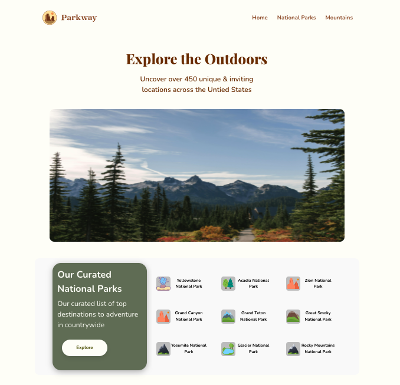
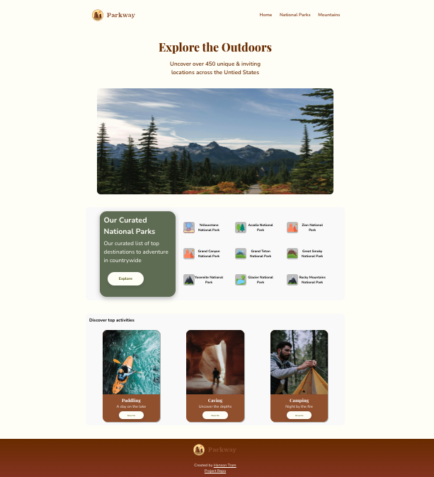
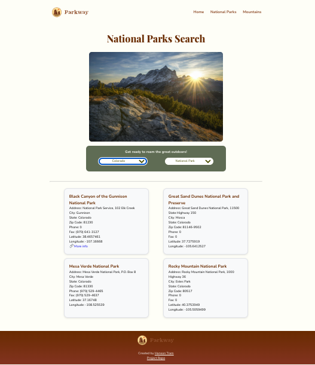
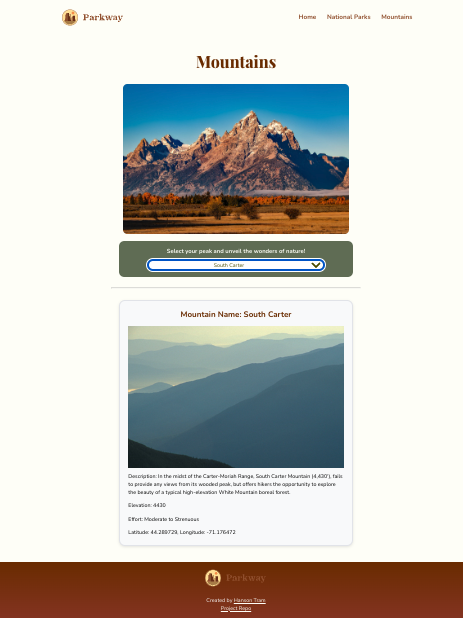

<!-- # Parkway  -->


Parkway is a website designed and created as a capstone project, it's a dedicated platform where enthusiasts, deeply connected to nature's wonders, curate a wealth of information about national parks and majestic mountains. 

#### 🔗 Live site: [ Parkway](https://nationalparkway.netlify.app/)


### Features:

Parkway website pages include:

<details>
  <summary>Home</summary>
  

</details>
<details>
  <summary>National Parks Search</summary>
  
     <p>Users have the ability to navigate effortlessly through a curated array of national parks using intuitive dropdown boxes. Choose to either showcase all parks from a comprehensive array of objects or refine your search by location and park type for a tailored exploration. </p>
</details>
<details>
  <summary>Mountains Search</summary>
   
        <p>Users have the ability to select an option of their desired mountain from a user-friendly dropdown box, revealing detailed information about the chosen mountain.</p>
</details>

### Technologies:
   - This website was built with HTML, CSS, Javascript

#### Run Locally:

##### 1. Clone project:

```javascript
git clone : https://github.com/hansontram/ecom-website.git
```

##### 2. Open in text editor:

- Open the file in your text editor and view the pages, css, & scripts folders
##### 3. Open in browser:

- Then open index.html in your browser or run live server extension to view the website


### Lessons learned:
   - Dynamically populate dropdown content through javascript
   - Learn JavaScript event handling, especially the `change` event for dropdowns.
   - Dynamically render components using DOM manipulation with JavaScript for creating, modifying, and removing elements.
   - Efficiently organize and structure data imported through scripts, typically containing arrays of objects.
   - Ensure visually pleasing and intuitive interfaces for a responsive UX using css media queries.
